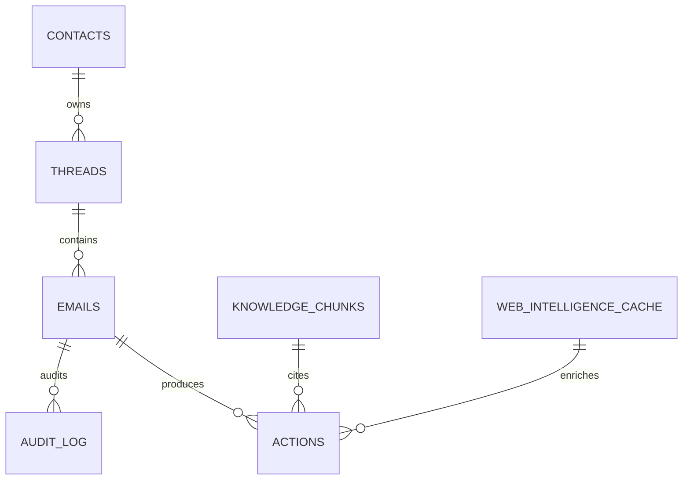

# Database ER Design

Required tables are implemented in `backend/app/models/domain.py` and the first Alembic migration is `backend/alembic/versions/0001_initial_schema.py`.

Indexes:

- `emails(sender, timestamp)` supports full thread and sentiment trend queries.
- `emails(category, urgency)` supports dashboard filtering.
- `threads(thread_id)` supports idempotent thread linking.
- `web_intelligence_cache(target_entity, expires_at)` supports six-hour scrape caching.
- `audit_log(entity_type, entity_id)` supports entity history lookup.
