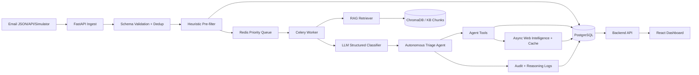
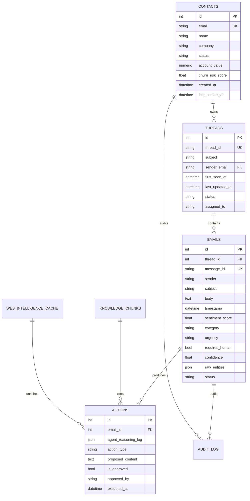

# SenAI Agentic CRM Intelligence Platform - Implementation Plan

## Source Analysis Notes

- Assessment PDF: 13 pages, "AI Intern - Technical Assessment: Agentic CRM Intelligence Platform & Real-Time Email Operations System".
- Uploaded dataset: `email-data-advanced.json`, 60 emails.
- Dataset discrepancy: the PDF says "30 threads" and describes Alice as 5 emails and Bob outage as 4 emails. The uploaded JSON contains 47 distinct `thread_id` values, Alice has 4 emails, and `thread_bob_outage` has 3 emails. This implementation treats the uploaded JSON as the source of truth while preserving sender-level history for Bob, including `thread_bob_api_limits`.

## Requirement Coverage Matrix

| Requirement | Implementation |
| --- | --- |
| Email ingestion API | `POST /api/ingest` validates schema, deduplicates by `message_id`, creates/updates thread and contact records. |
| Streaming simulation | `scripts/email_simulator.py` replays the JSON dataset at configurable speed. |
| Deduplication | Unique DB constraint on `emails.message_id`; service returns existing job/idempotent result. |
| Thread reconstruction | Thread rows keyed by uploaded `thread_id`; sender-level history is also available to the agent. |
| Priority queue | Heuristic priority score/category/urgency assigned synchronously on ingest. |
| Heuristic classification | Rule engine detects spam, internal mail, legal, GDPR, security, urgency, reputation risk, enterprise opportunities. |
| LLM classification | `LLMClassifier` uses structured JSON output; gracefully falls back to deterministic classification when no API key is present. |
| Sentiment trend tracking | Stores `sentiment_score`; analytics endpoint detects sender deterioration and returns trend points. |
| RAG pipeline | Markdown KB documents are chunked, embedded, stored, and searched through Chroma-compatible local service fallback. |
| Knowledge base generation | Six required `.md` files are included under `knowledge_base/`. |
| Autonomous agent | `TriageAgent` uses a bounded ReAct-style loop and tool registry. |
| Reasoning logs | Actions store full `Thought -> Action -> Observation -> Next Step` traces. |
| Audit logs | Mutating flows append audit entries with actor and diff JSON. |
| Contact profiles | Contacts include VIP/status/account value/churn risk and can be updated via API. |
| Analytics dashboard | Frontend includes inbox, thread workspace, and analytics views using Recharts. |
| Web intelligence | Async cached scraper service with robots.txt check and fixture fallback for G2/Trustpilot/competitor signals. |
| OpenAPI docs | FastAPI exposes Swagger; static `openapi.json` can be generated by `scripts/export_openapi.py`. |
| Docker deployment | Dockerfiles and `docker-compose.yml` start backend, frontend, PostgreSQL, Redis, worker, and Chroma. |
| Mandatory no auto-reply controls | Spam, ransomware, legal threats, GDPR requests, and Critical urgency are blocked from auto-send and escalated. |

## Dataset Scenario Inventory

| Scenario | Messages | Required Handling |
| --- | --- | --- |
| Bob outage escalation | `msg_002`, `msg_009`, `msg_060`; related sender history `msg_022`, `msg_042` | Critical/legal escalation, SLA RAG retrieval, account status Enterprise/renewal hold, legal flag, human escalation, holding draft only. |
| Karen reputation crisis | `msg_006`, `msg_018`, `msg_033` | Detect 3 negative/no-response emails, web intelligence trigger, refund/retention/escalation RAG, high-priority human escalation. |
| GDPR request | `msg_052` | Legal/compliance category, legal flag, compliance ticket, acknowledgement draft citing 30-day window, no generic auto-reply. |
| Ransomware threat | `msg_038` | Critical security incident, security queue escalation, no reply to attacker, audit trail. |
| Alice pricing upgrade | `msg_001`, `msg_005`, `msg_014`, `msg_041` | Use full thread, pricing policy, nonprofit discount and pro-rata billing context. |
| Nadia silent corruption bug | `msg_054` | Critical bug, engineering ticket, escalation due mission-critical data loss risk. |
| Chatbot misinformation | `msg_056` | Retrieve refund policy, acknowledge discrepancy without admitting liability, escalate and draft careful reply. |
| BigCorp RFP | `msg_029`, `msg_030`, `msg_047` | Link as high-value opportunity, compliance docs, enterprise profile, sales/legal/security handoff. |
| HIPAA compliance deal | `msg_021`, `msg_051` | Compliance category, 200-seat high-value deal, BAA/SOC2/data residency RAG, high urgency. |
| Legal cease-and-desist | `msg_020` | Legal flag and human escalation, never auto-reply. |
| Spam | `msg_003`, `msg_024`, `msg_031`, `msg_039`; newsletters/autoreplies are low priority | Ignore/no auto-reply; sender/domain reputation flags. |
| Security login | `msg_016` | Critical security escalation. |
| Reputation alert | `msg_053` | Web intelligence update and reputation-risk analytics. |
| Internal mail | `@internal.com`, `@mycompany.com`, plus operational platform/system senders | Routed to internal/ignored inbox depending source. |

## Architecture Diagram



## Database ER Design



## API Design

- Error envelope: `{ "error_code": "...", "message": "...", "details": {...} }`
- Core endpoints: all PDF-required endpoints are implemented under the documented paths.
- Async processing: ingestion creates a job row/result; local mode runs synchronously for deterministic tests, Docker mode can dispatch Celery tasks.
- Mutations create `audit_log` rows.
- `GET /threads/{contact_email}` returns sender history, thread emails, actions, and reasoning logs.

## RAG Architecture

- Source: six required markdown documents in `knowledge_base/`.
- Chunking: 300-500 token target with overlap.
- Embeddings: OpenAI embeddings when configured; deterministic hash embeddings for offline tests.
- Storage: Chroma in Docker; SQL mirror in `knowledge_chunks` for debug and citations.
- Retrieval: top-3 by cosine similarity plus keyword boost for legal/security/refund/SLA/compliance triggers.
- Prompting: retrieved chunks are injected with source document names and chunk IDs; replies cite policy documents.

## Agent Architecture

- Coordinator: `TriageAgent`.
- Tools: `search_knowledge_base`, `get_thread_history`, `get_contact_profile`, `check_account_status`, `draft_reply`, `escalate_to_human`, `create_internal_ticket`, `scrape_public_sentiment`, `flag_for_legal`, `send_auto_reply`.
- Bounds: maximum 6 tool calls.
- Safety gates: Critical/legal/GDPR/security/spam are never auto-sent.
- Trace format: array of `{thought, action, observation, next_step}`.
- Dry run: returns the planned trace and actions without mutating state.

## Web Intelligence Architecture

- Triggered by reputation words, sentiment below `-0.6`, high/critical complaints, press/investor signals, and pricing objections.
- Async scraper checks robots.txt before attempting a fetch.
- Cache table stores target, URL, JSON payload, scrape time, and expiry.
- Offline fallback fixtures keep tests deterministic and allow graceful degradation.

## Frontend Dashboard Design

- Mission Control Inbox: filter tabs, grouped threads, badges for sentiment/category/urgency, search, bulk action controls.
- Thread Workspace: timeline, highlighted entities, contact card, reasoning trace panel, RAG context panel, action buttons, web intelligence summary.
- Analytics Dashboard: sentiment line chart, category distribution, response heatmap placeholder, at-risk accounts, agent performance cards.

## Folder Structure

```text
backend/
  app/
    api/
    core/
    db/
    models/
    schemas/
    services/
  alembic/
frontend/
  src/
knowledge_base/
scripts/
docs/
tests/
docker-compose.yml
README.md
```

## Development Roadmap

1. Build backend domain model, validation, and deterministic classifiers.
2. Add RAG seed/search and required KB documents.
3. Implement agent tools, safety gates, reasoning trace storage, and scenario-specific routing.
4. Add API endpoints, audit logs, analytics, and simulator.
5. Build frontend dashboard with API-backed views.
6. Add Docker Compose, OpenAPI export, tests, and README.
7. Verify mandatory scenarios and edge cases.

## Complete Implementation Plan

- Use FastAPI/SQLAlchemy/Alembic/PostgreSQL as production path, with SQLite-compatible fallbacks for tests.
- Keep LLM calls behind an interface so evaluation can run offline. When `OPENAI_API_KEY` is absent, use deterministic structured classification that mirrors prompt output.
- Keep web scraping behind an interface with cache and fixtures so rate limits and robots failures do not block the agent.
- Seed known high-value contacts from dataset scenarios to demonstrate account status, renewal risk, and enterprise opportunity routing.
- Include tests for disqualifiers: duplicate ingestion, GDPR not generic inquiry, ransomware no reply, legal no reply, Bob trace actions, Karen web intelligence trigger, Alice RAG pricing, and Nadia engineering escalation.
